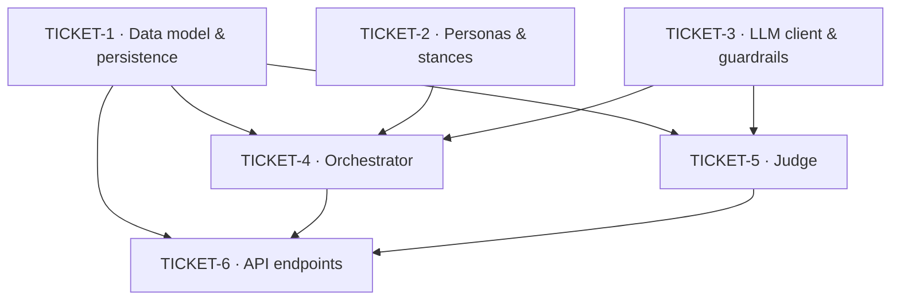

# Spec: EPIC-A — Debate Orchestration Engine (KAN-1)

> **Epic:** [KAN-1](https://osavelyev.atlassian.net/browse/KAN-1) · **Project:** KAN (Second Opinion)
> **PRD:** `docs/second-opinion-prd.md` (Confluence page 1048577) ·
> **Decision Log:** DEC-001…DEC-009 (page 1015810)
> **Story shape:** `docs/specs/STORY_TEMPLATE.md`
> **Published:** [Confluence breakdown](https://osavelyev.atlassian.net/wiki/spaces/~557058b71ec4cb4cec4df2b96f8e5302aff766/pages/1146881) (page 1146881, child of the PRD)

## Epic summary

The headless backend loop (Phase 1): from a single API call, assign 3 fixed personas,
run a 2-round transcript-aware debate with concurrent turns, invoke the Opus judge to
synthesize a schema-validated verdict, and persist the whole thing to SQLite. No frontend,
no streaming — those are EPIC-B/C. This epic is the engine everything else drives.

**Governing decisions (epic-level):** DEC-001, DEC-002, DEC-003, DEC-005, DEC-007, DEC-008.

## Shared contracts (defined in TICKET-1, consumed everywhere)

- **Debate** `{ id, decision, context?, status, created_at }`
- **Persona** `{ id, debate_id, archetype: advocate|skeptic|pragmatist, name, stance }`
- **Turn** `{ id, debate_id, persona_id, round, content, status: ok|skipped, created_at }`
- **Verdict** `{ id, debate_id, recommendation, cases: [{option, argument}], tradeoffs: [...] }`
- **Transcript** = ordered list of `Turn` rows for a debate; round N reads rounds `< N`.

Freezing these shapes in TICKET-1 is what lets the orchestrator (T4) and the judge (T5)
be built in parallel against the same schema.

## Tickets

### TICKET-1 — Data model & SQLite persistence layer
- **Summary:** _As a developer, I want Debate/Persona/Turn/Verdict persisted in SQLite, so that a debate survives the request and can be listed, re-opened, and deleted._
- **Scope / acceptance criteria:**
  - SQLAlchemy (or equivalent) models for Debate, Persona, Turn, Verdict per the shared contracts.
  - Engine/session setup; tables auto-created on startup (dev). SQLite file path from config.
  - Repository layer: `create_debate`, `add_persona`, `add_turn`, `set_verdict`, `get_debate` (with transcript+verdict), `list_debates`, `delete_debate` (cascades children).
  - Unit tests for the repository round-trip (create → read back → delete).
- **Governing decisions:** DEC-008 (SQLite dev persistence), DEC-005 (single-user, no ownership column).
- **Files (est.):** `backend/app/db/session.py`, `backend/app/models/*.py`, `backend/app/repositories/debates.py`, `backend/app/core/config.py` (add `DATABASE_URL`), `backend/tests/test_repository.py`
- **Depends on:** none.

### TICKET-2 — Persona archetypes & stance framing
- **Summary:** _As a viewer, I want three distinct personas that each argue a different position framed to my specific decision, so that I hear the sides I'd have missed._
- **Scope / acceptance criteria:**
  - Three fixed archetypes — Advocate, Skeptic, Pragmatist — each with a distinct system prompt and display name/color key.
  - `assign_personas(decision, context)` frames a per-decision stance for each archetype and returns Persona records (the `personas_assigned` payload).
  - Pure/deterministic given inputs (stance framing may call the LLM utility tier, but archetype set is fixed); unit-tested with a sample decision.
  - No orchestration or persistence here — returns in-memory Persona objects.
- **Governing decisions:** DEC-001 (3 fixed archetypes), DEC-002 (stances framed per decision).
- **Files (est.):** `backend/app/services/personas.py`, `backend/app/prompts/personas.py`, `backend/tests/test_personas.py`
- **Depends on:** TICKET-1 (Persona shape) — contract only; can start in parallel once contracts are frozen.

### TICKET-3 — LLM turn client, model tiers & cost guardrails
- **Summary:** _As a developer, I want every model call to go through a guarded client with hard caps and graceful per-turn failure, so that one dropped turn or a cost spike never breaks or balloons a debate._
- **Scope / acceptance criteria:**
  - Extend `services/llm.py`: model-tier selection — personas `claude-sonnet-5`, judge `claude-opus-4-8`, utilities `claude-haiku-4-5` (IDs from config; confirm at build time per DEC-007).
  - Guardrails enforced **before** each call: hard caps on personas, rounds, and tokens per debate.
  - Per-turn retry with backoff; on repeated failure, return a `skipped` turn instead of raising.
  - Cost/latency logged per call (tokens in/out) for later observability.
  - Unit tests with a mocked Anthropic client (cap exceeded → blocked; transient error → retried; persistent error → skipped).
- **Governing decisions:** DEC-007 (model tiers + structured judge), plus the PRD §9 cost guardrails.
- **Files (est.):** `backend/app/services/llm.py`, `backend/app/core/guardrails.py`, `backend/app/core/config.py` (model IDs + caps), `backend/tests/test_guardrails.py`
- **Depends on:** none (foundational).

### TICKET-4 — Debate orchestrator (concurrent turns, sequential rounds)
- **Summary:** _As a viewer, I want a 2-round debate where personas answer each other, so that it feels like a real discussion rather than three monologues._
- **Scope / acceptance criteria:**
  - `run_debate(debate)` executes 2 rounds; within a round the 3 persona turns run **concurrently** (async); rounds run **sequentially** and round N is given the transcript of rounds `< N`.
  - Each completed turn is persisted (TICKET-1) as it lands; failed turns are recorded as `skipped` (via TICKET-3) and the debate continues.
  - Produces the full transcript object the judge consumes; no HTTP concerns here.
  - Tests: 2 rounds × 3 personas = up to 6 turns; a forced skip still completes the debate.
- **Governing decisions:** DEC-003 (2 rounds), DEC-001/002 (personas), DEC-008 (persist turns).
- **Files (est.):** `backend/app/services/orchestrator.py`, `backend/tests/test_orchestrator.py`
- **Depends on:** TICKET-1, TICKET-2, TICKET-3.

### TICKET-5 — Judge synthesis with structured output + repair retry
- **Summary:** _As a decision-maker, I want a balanced verdict with the strongest case for each option and the key trade-offs, so that I can decide with a clear head — and trust it links back to the debate._
- **Scope / acceptance criteria:**
  - `judge(transcript)` runs last on the full transcript using the Opus tier.
  - Returns a schema-validated `Verdict` (Pydantic): recommendation, case-per-option, trade-offs; **one repair retry** on schema mismatch, then hard error if still invalid.
  - Verdict persisted (TICKET-1) and linkable to its transcript.
  - Tests: valid JSON passes; malformed-then-valid triggers exactly one repair; malformed-twice raises.
- **Governing decisions:** DEC-007 (structured, schema-validated verdict + repair).
- **Files (est.):** `backend/app/services/judge.py`, `backend/app/schemas/verdict.py`, `backend/app/prompts/judge.py`, `backend/tests/test_judge.py`
- **Depends on:** TICKET-1, TICKET-3 (transcript contract from T1 lets this run parallel to T4; integrates after T4).

### TICKET-6 — Debate API endpoints
- **Summary:** _As a decision-maker, I want to POST a decision and later fetch, list, and delete debates, so that the whole loop is usable over HTTP and my history is mine to manage._
- **Scope / acceptance criteria:**
  - `POST /api/debates` — create from `{decision, context?}`, run orchestrator (T4) → judge (T5), persist, return `debate_id` (+ completed debate).
  - `GET /api/debates/{id}` — full transcript + verdict; `GET /api/debates` — history list; `DELETE /api/debates/{id}` — remove (privacy).
  - Pydantic request/response schemas; routes registered in `main.py`; 404 on missing id.
  - Integration test: scripted decision → persisted transcript + verdict returned; delete removes it.
- **Governing decisions:** DEC-005 (no auth), DEC-008 (persistence), DEC-004 (watch-only — no mid-debate input endpoints).
- **Files (est.):** `backend/app/api/routes/debates.py`, `backend/app/schemas/debate.py`, `backend/app/main.py`, `backend/tests/test_debates_api.py`
- **Depends on:** TICKET-1, TICKET-4, TICKET-5.

## Dependency graph

## Suggested execution order

- **Wave 1 (parallel):** TICKET-1, TICKET-2, TICKET-3 — independent, touch different files. (Freeze the shared contracts in T1 first so T2/T3 code against them.)
- **Wave 2 (parallel):** TICKET-4 and TICKET-5 — both build on Wave 1; they meet at the transcript contract, so they can run in separate worktrees (`/new-worktrees`) and integrate in Wave 3.
- **Wave 3:** TICKET-6 — wires orchestrator + judge behind the HTTP surface.

## Definition of Done (per ticket)

Each ticket follows `STORY_TEMPLATE.md`: acceptance criteria met + `/validate` green,
`/code-review` clean, Decision Log "Implemented by" updated for the DECs it realizes, and
the commit references its governing `DEC-xxx` (per the commit-msg hook).
