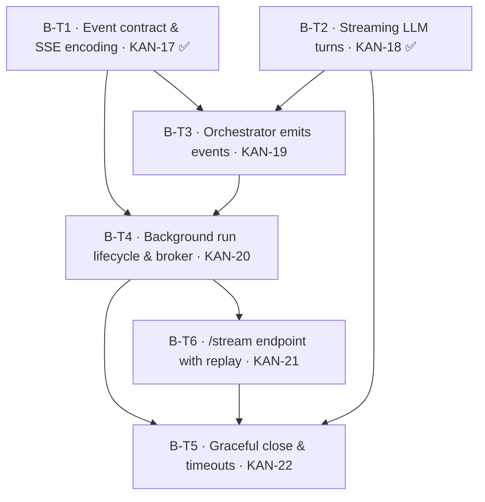

# Spec: EPIC-B — Live Streaming (KAN-2)

## Source and goal
- PRD: [Second Opinion — PRD (MVP)](https://osavelyev.atlassian.net/wiki/spaces/~557058b71ec4cb4cec4df2b96f8e5302aff766/pages/1048577) (Confluence page 1048577; last modified 2026-08-28; status on page: *Draft — awaiting approval*). Local copy: `docs/second-opinion-prd.md`.
- Jira epic: [KAN-2](https://osavelyev.atlassian.net/browse/KAN-2) — EPIC-B — Live Streaming (project KAN)
- Breakdown page: [Spec: EPIC-B — Live Streaming - Ticket Breakdown](https://osavelyev.atlassian.net/wiki/spaces/~557058b71ec4cb4cec4df2b96f8e5302aff766/pages/9535489) (page 9535489, child of the PRD)
- Constraining decisions: DEC-003 (fixed 2 rounds), DEC-004 (watch-only), DEC-005 (single-user, local — in-process broker is sufficient), DEC-007 (Sonnet persona tier; judge stays structured, non-streamed), DEC-008 (persist-as-it-lands), DEC-011 (architecture doc updated with the streaming design). **DEC-012** (run lifecycle for streaming — Accepted 2026-09-24) governs B-T4/B-T5/B-T6.
- Story shape: `docs/specs/STORY_TEMPLATE.md`
- Goal: Stream a debate to the client live over Server-Sent Events (PRD Phase 2) so it feels like watching a real discussion: personas appear, turns arrive token by token, rounds close, then the verdict and a terminal `done`. The stream must always end with `done` or `error`, even under failures and timeouts. Backend only — the UI that consumes it is EPIC-C (KAN-3).

### Current implementation (evidence)
- `POST /api/debates` today **creates and runs the whole debate synchronously** (orchestrator → judge → persist) and returns the completed aggregate (KAN-9). There is no `debate_id`-first response and no streaming.
- `LLMService.run_turn` is synchronous and non-streaming (`messages.create`); the orchestrator fans turns out with `asyncio.to_thread` and persists each turn on its own thread as it lands (KAN-7).
- The judge (`judge()` via `LLMService.complete`) is synchronous and schema-validated with one repair retry (KAN-8, DEC-007). It is not streamed — the verdict arrives as a single event.
- No SSE library is installed (`pyproject.toml`); FastAPI `StreamingResponse` is enough, so adding a dependency is optional.
- **Shipped since the first slice (2026-09-24):** the event contract + `encode_sse` + `EventSink` (KAN-17) and `LLMService.stream_turn` (KAN-18). Nothing emits or serves events yet; the orchestrator still uses `run_turn`.

## Event contract (frozen in B-T1, consumed everywhere)

Wire format: one SSE frame per event — `id: <seq>` / `event: <type>` / `data: <json>` — with a per-debate monotonically increasing `seq`.

| Event | Payload (indicative) | When |
| --- | --- | --- |
| `personas_assigned` | `{debate_id, personas: [{id, archetype, name, stance}]}` | After the 3 personas are persisted |
| `turn_started` | `{round, persona_id}` | A persona turn begins |
| `turn_delta` | `{round, persona_id, text}` | Each streamed text chunk |
| `turn_completed` | `{round, persona_id, turn_id, status: ok\|skipped, content}` | Turn persisted (full content, authoritative) |
| `round_completed` | `{round}` | All 3 turns of the round have landed (×2 per DEC-003) |
| `verdict` | `{recommendation, cases, tradeoffs}` | Judge verdict persisted |
| `done` | `{debate_id, status}` | Terminal: success |
| `error` | `{code, message}` | Terminal: failure |

Exactly one terminal event (`done` **or** `error`) ends every stream. The PRD §6 lists a subset of these events; `turn_started`/`turn_completed` come from the KAN-2 epic scope and are additive (see Gaps).

## Tickets

### B-T1 — SSE event contract & wire encoding
- Outcome and scope: _As a developer, I want one typed, frozen definition of every debate stream event and its SSE wire format, so that the orchestrator, the endpoint, and the future UI all agree on the stream without guessing._ Pydantic models for the 8 events above (discriminated by `type`), a per-debate sequence counter, an `encode_sse(event)` helper producing `id:/event:/data:` frames, and an `EventSink` protocol (async `emit(event)`) that producers write to. Mirror the event types in `frontend/src/types/` (types only — no UI, so the DEC-010 frontend gate does not apply).
- Acceptance criteria:
  - [ ] Every event type in the contract table has a Pydantic model; unknown types are rejected.
  - [ ] `encode_sse` emits spec-compliant frames (`id`, `event`, single-line JSON `data`, blank-line terminator); multi-line text in `turn_delta` survives a JSON round-trip.
  - [ ] `EventSink` protocol plus an in-memory list sink for tests.
  - [ ] Matching TypeScript types in `frontend/src/types/debateEvents.ts`.
- Validation: unit tests for encoding of each event type, including newline/unicode content and a round-trip `data` → model parse; `tsc` type-check passes.
- Likely files/components: `backend/app/schemas/events.py`, `backend/app/services/events.py` (sink + encoder), `backend/tests/test_events.py`, `frontend/src/types/debateEvents.ts`
- Decisions: DEC-003 (two `round_completed` events), DEC-004 (server → client only; no inbound event types)
- Depends on: none
- Jira issue: [KAN-17](https://osavelyev.atlassian.net/browse/KAN-17) — Done (PR #12, `8399df3`)

### B-T2 — Streaming persona turns in the LLM client
- Outcome and scope: _As a viewer, I want each persona's words to arrive as they are generated, so that the debate feels alive rather than appearing in blocks._ Add `LLMService.stream_turn(..., on_delta)` using the Anthropic streaming Messages API on the persona tier. It keeps `run_turn`'s guarantees: guardrails checked before the call, retry with backoff, cost/latency logged, never raises (it degrades to a `skipped` `TurnResult`). It also adds a **per-turn timeout** (config) that yields `skipped`.
- Acceptance criteria:
  - [ ] `on_delta(text)` is invoked for each text delta in order; the returned `TurnResult.text` equals the concatenation of the deltas.
  - [ ] Guardrail breach → `skipped` with no API call and no deltas.
  - [ ] Transient failure **before the first delta** is retried with backoff. A failure **after** deltas were emitted is not retried; it returns `skipped` (reason recorded) so no client sees duplicated text.
  - [ ] Per-turn timeout (e.g. `turn_timeout_seconds` in `config.py`) → `skipped` with reason `timeout`.
  - [ ] Tokens in/out recorded to guardrails and logged exactly as `run_turn` does; `run_turn` itself is unchanged.
- Validation: unit tests with a mocked streaming client covering: happy-path deltas, guardrail block, retry-before-first-delta, failure-mid-stream → skipped, timeout → skipped.
- Likely files/components: `backend/app/services/llm.py`, `backend/app/core/config.py`, `backend/tests/test_llm.py`
- Decisions: DEC-007 (persona tier = Sonnet), PRD §8 cost guardrails
- Depends on: none
- Jira issue: [KAN-18](https://osavelyev.atlassian.net/browse/KAN-18) — Done (PR #13, `dc7e91b`)

### B-T3 — Orchestrator emits debate events
- Outcome and scope: _As a viewer, I want the debate engine to announce each step (personas, turn start, tokens, turn end, round end) as it happens, so that a stream can show the debate live._ `run_debate` gains an optional `sink: EventSink`. When one is given, it uses `stream_turn` and emits `personas_assigned`, `turn_started`, `turn_delta`, `turn_completed`, and `round_completed`. Deltas from worker threads are bridged onto the event loop thread-safely (`loop.call_soon_threadsafe` / `asyncio.Queue`). All DB writes stay on the orchestrator thread (unchanged). Without a sink, behavior and output match today's.
- Acceptance criteria:
  - [ ] With a sink, a 2-round × 3-persona run emits, in causal order: 1 `personas_assigned`; per turn `turn_started` → ≥0 `turn_delta` → `turn_completed`; 1 `round_completed` per round (after that round's 3 `turn_completed`).
  - [ ] `turn_completed` is emitted only **after** the turn row is committed, and carries the persisted `turn_id`, status, and full content.
  - [ ] A skipped turn emits `turn_completed{status: skipped}` and the debate continues (existing skip tolerance preserved).
  - [ ] Concurrent turns' deltas interleave but each is tagged with its `persona_id`/`round`; per-persona delta order is preserved.
  - [ ] No sink → existing `test_orchestrator.py` passes unchanged. The orchestrator emits no `verdict`/`done`/`error` (the run pipeline in B-T4 owns those).
- Validation: orchestrator tests with a stub streaming LLM and the in-memory sink asserting event sequence and ordering invariants, plus a forced-skip case; existing orchestrator tests still green.
- Likely files/components: `backend/app/services/orchestrator.py`, `backend/tests/test_orchestrator.py` (or `test_orchestrator_events.py`)
- Decisions: DEC-003 (2 sequential rounds, concurrent turns), DEC-001/002 (personas), DEC-008 (persist-as-it-lands before announcing)
- Depends on: B-T1 (KAN-17), B-T2 (KAN-18)
- Jira issue: [KAN-19](https://osavelyev.atlassian.net/browse/KAN-19) (new; linked: KAN-17 blocks, KAN-18 blocks)

### B-T4 — Background run lifecycle & in-process broker (POST → 202)
- Outcome and scope: _As a decision-maker, I want starting a debate to return immediately while the debate runs on its own, so that closing or refreshing the page never loses or restarts it._ Implements the run half of DEC-012:
  - `POST /api/debates` returns **202** `{id, status: "pending"}` without waiting.
  - The run itself is a pipeline (orchestrator → judge → persist → `verdict` → terminal event). It executes as an `asyncio` task in an **app-lifespan-owned run registry** and opens its **own** DB session.
  - It publishes to a **per-debate broker** that owns the debate's `EventSequencer` and keeps its **full sequenced event log in memory** while running. The broker also exposes an async subscribe API, with replay from the log, for B-T6.
  - Startup **restart sweep** and shutdown handling are included.
  - Concurrency cap `max_active_debates`.
  - No HTTP streaming here (that's B-T6).
- Acceptance criteria:
  - [ ] `POST /api/debates` → **202** `{id, status: "pending"}` promptly. The run proceeds in the background and completes the same aggregate `GET /api/debates/{id}` returns today. `test_debates_api.py` is updated for the new contract, with no synchronous/`?wait` mode.
  - [ ] Runs are tracked in a lifespan-owned registry (not FastAPI `BackgroundTasks`), each with its own DB session. On shutdown, active runs are cancelled and their debates marked `FAILED`.
  - [ ] The broker per debate owns its `EventSequencer` and appends every `SequencedEvent` to an in-memory log. `subscribe(debate_id, after_seq=None)` yields the log (optionally after `after_seq`) and then live events, with no gaps or duplicates. The log is dropped once the run is terminal and all subscribers are gone.
  - [ ] Pipeline events:
    - the orchestrator's events (via KAN-19's sink), then `verdict`, then `done{status: completed}`;
    - a judge failure keeps the transcript (`COMPLETED`, `verdict: null`) and ends `error{code: "judge_failed"}`;
    - an unexpected exception → `FAILED` + `error{code: "internal"}`.
  - [ ] Restart sweep: on startup every `PENDING`/`RUNNING` debate is marked `FAILED`.
  - [ ] `max_active_debates` (config, default 2). A `POST` beyond the cap → **409**, and no debate row is left `PENDING`.
- Validation: unit tests for the broker, covering log replay then live events, `after_seq`, multiple subscribers and cleanup. Registry/pipeline tests with a stub streaming LLM cover: POST → 202 then completion, judge failure → `error`, exception → `FAILED`/`internal`, shutdown cancellation, restart sweep, and the 409 at the cap. Update `test_debates_api.py`.
- Likely files/components: `backend/app/services/broker.py`, `backend/app/services/debate_runner.py` (pipeline + registry), `backend/app/main.py` (lifespan: registry, sweep, shutdown), `backend/app/api/routes/debates.py` (POST), `backend/app/db/session.py` (session factory for background runs), `backend/app/core/config.py` (`max_active_debates`), `backend/app/schemas/debate.py`, tests; `docs/architecture.md` + Confluence 917506 (DEC-011)
- Decisions: **DEC-012** (Accepted — rules 1, 2 [broker/log half], 3, 4, 5), DEC-004, DEC-005 (single worker, in-process), DEC-007 (judge non-streamed), DEC-008
- Depends on: B-T1 (KAN-17, done), B-T3 (KAN-19)
- Jira issue: [KAN-20](https://osavelyev.atlassian.net/browse/KAN-20) (new; linked: KAN-17, KAN-19 block it)

### B-T6 — `GET /api/debates/{id}/stream` SSE endpoint with replay
- Outcome and scope: _As a viewer, I want to open (or reopen) a debate and watch it stream live from wherever it is, so that joining late, refreshing, or revisiting a finished debate all just work._ Implements the stream half of DEC-012. It's a `text/event-stream` endpoint that relays the B-T4 broker for running debates, honoring `Last-Event-ID`, and synthesizes replay from SQLite for finished/failed/interrupted debates. Every stream ends with exactly one terminal event.
- Acceptance criteria:
  - [ ] `GET /api/debates/{id}/stream` → `text/event-stream` frames via KAN-17's `encode_sse`; **404** for an unknown id.
  - [ ] **Running debate:** replays the in-memory log from the start (or after `Last-Event-ID`), then live events, with no gaps or duplicates (seq-ordered). It ends with the run's terminal event and then closes.
  - [ ] **Completed debate:** replay synthesized from SQLite (`personas_assigned`, each `turn_completed`, `round_completed` per round, `verdict` if present), then `done`, or `error{code: "judge_failed"}` when `verdict` is null. Then it closes.
  - [ ] **`FAILED` debate** (timeout, internal, or restart-swept): replays what was persisted, then `error` with a matching code (`interrupted` for restart-swept).
  - [ ] End-to-end: a client streaming from `POST` onward receives personas → turns (with deltas) → 2× `round_completed` → `verdict` → `done`.
- Validation: API tests with httpx streaming and a stub streaming LLM, covering:
  - full live stream;
  - a mid-run join and `Last-Event-ID` resume (no gaps or duplicates);
  - completed-debate replay;
  - judge-failed replay;
  - an interrupted debate;
  - unknown id → 404.

  Manual check: `curl -N` against a real run.
- Likely files/components: `backend/app/api/routes/debates.py` (stream route), `backend/app/services/replay.py` (SQLite → events synthesis), `backend/tests/test_stream_api.py`; `docs/architecture.md` + Confluence 917506
- Decisions: **DEC-012** (Accepted — rules 1, 2, 4, 5), DEC-004, DEC-008
- Depends on: B-T4
- Jira issue: [KAN-21](https://osavelyev.atlassian.net/browse/KAN-21) (new; linked: KAN-20 blocks it)

### B-T5 — Graceful close: per-debate timeout, keepalive, disconnects
- Outcome and scope: _As a viewer, I want the stream to always end cleanly, even if something hangs or I close the tab, so that the client never waits forever and a run never leaks._ This ticket covers:
  - a per-debate wall-clock timeout, which **abandons** stuck turns per DEC-012;
  - periodic SSE keepalive comments;
  - client-disconnect handling, where the run continues;
  - a guaranteed single terminal event on any path.

  Per-turn timeouts are in B-T2, but as built (KAN-18) that bound is **soft**. A stream that sends only keepalive pings keeps resetting the read timeout and can exceed `turn_timeout_seconds`, so B-T5's per-debate timeout is the **outer bound** for it.
- Acceptance criteria:
  - [ ] The per-debate timeout also bounds a persona turn stuck on a ping-only stream, which KAN-18's per-turn budget cannot do. `asyncio.to_thread` cannot kill the worker thread, so the stuck turn is **abandoned** (DEC-012): its late result is discarded and never persisted or emitted.
  - [ ] Per-debate timeout (config, e.g. `debate_timeout_seconds`) → run cancelled, debate status `FAILED`, subscribers get `error{code: "timeout"}`; completed turns stay persisted.
  - [ ] Any unhandled exception in the run pipeline → `error{code: "internal"}` terminal event, status `FAILED` (try/finally guarantees exactly one terminal event).
  - [ ] Keepalive `: ping` comment every N seconds (config) while a stream is idle.
  - [ ] Client disconnect frees the subscriber without affecting the run (DEC-012); no broker/subscriber leak after the debate ends.
  - [ ] No stream ever closes without exactly one `done` or `error`.
- Validation: failure-injection tests:
  - a stub LLM that hangs or sends only pings → debate timeout, with the stuck turn abandoned and never persisted;
  - a stub that raises → internal error.

  A disconnect test asserts the run still completes and persists. A keepalive is observed with a short test interval.
- Likely files/components: `backend/app/services/debate_runner.py`, `backend/app/services/broker.py`, `backend/app/api/routes/debates.py`, `backend/app/core/config.py`, `backend/tests/test_stream_resilience.py`
- Decisions: **DEC-012** (Accepted — rule 5), DEC-008 (partial transcript kept), PRD §12 (terminal `done`/`error`, per-turn and per-debate timeouts)
- Depends on: B-T4, B-T6 (and B-T2 / KAN-18 for per-turn timeout)
- Jira issue: [KAN-22](https://osavelyev.atlassian.net/browse/KAN-22) (new; linked: KAN-20, KAN-21, KAN-18 block it)

## Dependencies and execution order

- **Done:** B-T1 (KAN-17), B-T2 (KAN-18). DEC-012 is Accepted, so nothing is gated on a decision any more.
- **Wave 2:** B-T3 (KAN-19).
- **Wave 3:** B-T4 (KAN-20). It needs KAN-19's sink wiring to have events to publish.
- **Wave 4:** B-T6 (KAN-21).
- **Wave 5:** B-T5 (KAN-22).

Integration notes:
- B-T3 → B-T4 → B-T6 → B-T5 are strictly sequential. They all touch the run path (`orchestrator.py`, `debate_runner.py`, `broker.py`, `routes/debates.py`), so don't run them in parallel worktrees.
- B-T4 changes the `POST` contract that `test_debates_api.py` (KAN-9) asserts, and EPIC-C (KAN-3) consumes the new POST + stream.

## Gaps and assumptions
- **Run lifecycle — decided (DEC-012 Accepted 2026-09-24):** option (a) with five amendments:
  - an in-memory event log for replay while running, and SQLite-synthesized replay afterwards;
  - a restart sweep, with `interrupted` as the error code;
  - a lifespan task registry, with a single worker process;
  - abandon-on-timeout plus the `max_active_debates` cap (409);
  - POST → 202.

  This split the old B-T4 into B-T4 (run + broker) and B-T6 (stream endpoint).
- **Event set: PRD vs epic.** PRD §6 lists `personas_assigned, turn_delta, round_completed, verdict, done, error`. The KAN-2 epic adds `turn_started` and `turn_completed`. They don't conflict — the epic adds events without changing the PRD's — so B-T1 includes all 8. `turn_completed` gives the client the authoritative persisted content even if it missed deltas. Confirm, or drop them to match the PRD strictly.
- **Mid-stream failure policy (built in KAN-18):** only transient failures are retried, and only before the first delta. A failure after partial text becomes a `skipped` turn, so no client sees duplicated text. The per-turn budget is soft for ping-only streams — see B-T5.
- **Judge is not token-streamed.** DEC-007 needs a schema-validated JSON verdict with repair, so the verdict arrives as one `verdict` event. Streaming the judge is out of scope.
- **Error codes** (DEC-012): `judge_failed`, `timeout`, `internal`, `interrupted`. KAN-17's `KNOWN_ERROR_CODES` constant is still marked provisional. Update it to this set in B-T4 and drop the "provisional" note.
- **PRD status** on Confluence still reads *Draft — awaiting approval*. EPIC-A was already sliced and shipped from this same PRD, so the scope is treated as stable. Flag it if that's wrong.
- **Out of scope here:**
  - Frontend consumption of the stream (EventSource hook, UI) is EPIC-C. Only the TS event types are mirrored here (B-T1).
  - Cost/latency observability beyond existing per-call logging is EPIC-D (KAN-4).

## Publication status
- Confluence: published as page 9535489 (child of PRD 1048577) — https://osavelyev.atlassian.net/wiki/spaces/~557058b71ec4cb4cec4df2b96f8e5302aff766/pages/9535489
- Jira:
  - Created KAN-17 (B-T1), KAN-18 (B-T2), KAN-19 (B-T3) as Stories under KAN-2. KAN-17 and KAN-18 were Done 2026-09-24 (PRs #12/#13).
  - Existing `Blocks` links: KAN-17→KAN-19, KAN-18→KAN-19.
  - Created 2026-09-24 after DEC-012 was Accepted: KAN-20 (B-T4), KAN-21 (B-T6), KAN-22 (B-T5).
  - `Blocks` links: KAN-17→KAN-20, KAN-19→KAN-20, KAN-20→KAN-21, KAN-20→KAN-22, KAN-21→KAN-22, KAN-18→KAN-22.
- Decision Log: DEC-012 **Accepted** (page 1015810, v13, 2026-09-24).

## Definition of Done (per ticket)
Each ticket follows `STORY_TEMPLATE.md`: acceptance criteria met and `/validate` green, `/code-review` clean, the Decision Log "Implemented by" entry updated for the DECs it realizes (DEC-003/004/007 for this epic; DEC-012 for B-T4/B-T5/B-T6), `docs/architecture.md` and Confluence 917506 updated when the streaming design lands (DEC-011), and the commit references its governing `DEC-xxx`.
