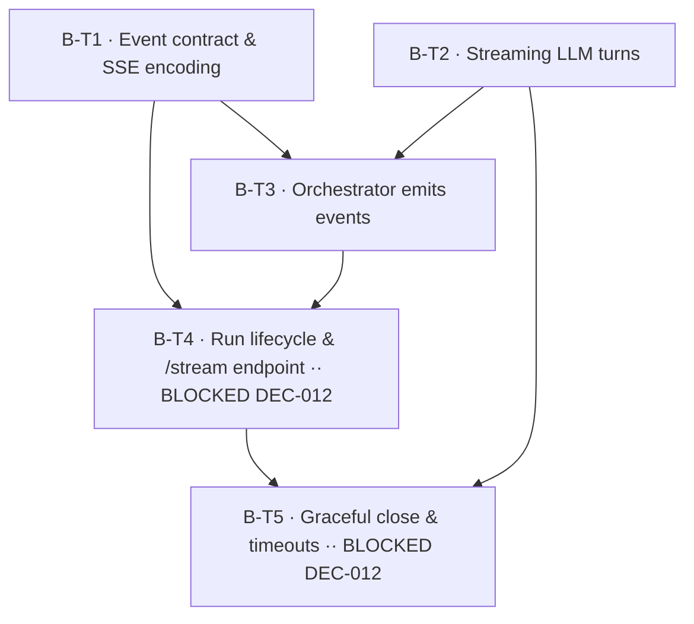

# Spec: EPIC-B — Live Streaming (KAN-2)

## Source and goal
- PRD: [Second Opinion — PRD (MVP)](https://osavelyev.atlassian.net/wiki/spaces/~557058b71ec4cb4cec4df2b96f8e5302aff766/pages/1048577) (Confluence page 1048577; last modified 2026-08-28; status on page: *Draft — awaiting approval*). Local copy: `docs/second-opinion-prd.md`.
- Jira epic: [KAN-2](https://osavelyev.atlassian.net/browse/KAN-2) — EPIC-B — Live Streaming (project KAN)
- Breakdown page: [Spec: EPIC-B — Live Streaming - Ticket Breakdown](https://osavelyev.atlassian.net/wiki/spaces/~557058b71ec4cb4cec4df2b96f8e5302aff766/pages/9535489) (page 9535489, child of the PRD)
- Constraining decisions: DEC-003 (fixed 2 rounds), DEC-004 (watch-only), DEC-005 (single-user, local — in-process broker is sufficient), DEC-007 (Sonnet persona tier; judge stays structured, non-streamed), DEC-008 (persist-as-it-lands), DEC-011 (architecture doc updated with the streaming design). **Proposed:** DEC-012 (run lifecycle for streaming) — gates B-T4/B-T5.
- Story shape: `docs/specs/STORY_TEMPLATE.md`
- Goal: Stream a debate to the client live over Server-Sent Events (PRD Phase 2) so it feels like watching a real discussion: personas appear, turns arrive token by token, rounds close, then the verdict and a terminal `done`. The stream must always end with `done` or `error`, even under failures and timeouts. Backend only — the UI that consumes it is EPIC-C (KAN-3).

### Current implementation (evidence)
- `POST /api/debates` today **creates and runs the whole debate synchronously** (orchestrator → judge → persist) and returns the completed aggregate (KAN-9). There is no `debate_id`-first response and no streaming.
- `LLMService.run_turn` is synchronous and non-streaming (`messages.create`); the orchestrator fans turns out with `asyncio.to_thread` and persists each turn on its own thread as it lands (KAN-7).
- The judge (`judge()` via `LLMService.complete`) is synchronous and schema-validated with one repair retry (KAN-8, DEC-007). It is not streamed — the verdict arrives as a single event.
- No SSE library is installed (`pyproject.toml`); FastAPI `StreamingResponse` is enough, so adding a dependency is optional.

## Event contract (frozen in B-T1, consumed everywhere)

Wire format: one SSE frame per event — `id: <seq>` / `event: <type>` / `data: <json>` — with a per-debate monotonically increasing `seq`.

| Event | Payload (indicative) | When |
| --- | --- | --- |
| `personas_assigned` | `{debate_id, personas: [{id, archetype, name, stance}]}` | After the 3 personas are persisted |
| `turn_started` | `{round, persona_id}` | A persona turn begins |
| `turn_delta` | `{round, persona_id, text}` | Each streamed text chunk |
| `turn_completed` | `{round, persona_id, turn_id, status: ok\|skipped, content}` | Turn persisted (full content, authoritative) |
| `round_completed` | `{round}` | All 3 turns of the round have landed (×2 per DEC-003) |
| `verdict` | `{recommendation, cases, tradeoffs}` | Judge verdict persisted |
| `done` | `{debate_id, status}` | Terminal: success |
| `error` | `{code, message}` | Terminal: failure |

Exactly one terminal event (`done` **or** `error`) ends every stream. The PRD §6 lists a subset of these events; `turn_started`/`turn_completed` come from the KAN-2 epic scope and are additive (see Gaps).

## Tickets

### B-T1 — SSE event contract & wire encoding
- Outcome and scope: _As a developer, I want one typed, frozen definition of every debate stream event and its SSE wire format, so that the orchestrator, the endpoint, and the future UI all agree on the stream without guessing._ Pydantic models for the 8 events above (discriminated by `type`), a per-debate sequence counter, an `encode_sse(event)` helper producing `id:/event:/data:` frames, and an `EventSink` protocol (async `emit(event)`) that producers write to. Mirror the event types in `frontend/src/types/` (types only — no UI, so the DEC-010 frontend gate does not apply).
- Acceptance criteria:
  - [ ] Every event type in the contract table has a Pydantic model; unknown types are rejected.
  - [ ] `encode_sse` emits spec-compliant frames (`id`, `event`, single-line JSON `data`, blank-line terminator); multi-line text in `turn_delta` survives a JSON round-trip.
  - [ ] `EventSink` protocol plus an in-memory list sink for tests.
  - [ ] Matching TypeScript types in `frontend/src/types/debateEvents.ts`.
- Validation: unit tests for encoding of each event type, including newline/unicode content and a round-trip `data` → model parse; `tsc` type-check passes.
- Likely files/components: `backend/app/schemas/events.py`, `backend/app/services/events.py` (sink + encoder), `backend/tests/test_events.py`, `frontend/src/types/debateEvents.ts`
- Decisions: DEC-003 (two `round_completed` events), DEC-004 (server → client only; no inbound event types)
- Depends on: none
- Jira issue: [KAN-17](https://osavelyev.atlassian.net/browse/KAN-17) (new)

### B-T2 — Streaming persona turns in the LLM client
- Outcome and scope: _As a viewer, I want each persona's words to arrive as they are generated, so that the debate feels alive rather than appearing in blocks._ Add `LLMService.stream_turn(..., on_delta)` using the Anthropic streaming Messages API on the persona tier. It keeps `run_turn`'s guarantees: guardrails checked before the call, retry with backoff, cost/latency logged, never raises (it degrades to a `skipped` `TurnResult`). It also adds a **per-turn timeout** (config) that yields `skipped`.
- Acceptance criteria:
  - [ ] `on_delta(text)` is invoked for each text delta in order; the returned `TurnResult.text` equals the concatenation of the deltas.
  - [ ] Guardrail breach → `skipped` with no API call and no deltas.
  - [ ] Transient failure **before the first delta** is retried with backoff. A failure **after** deltas were emitted is not retried; it returns `skipped` (reason recorded) so no client sees duplicated text.
  - [ ] Per-turn timeout (e.g. `turn_timeout_seconds` in `config.py`) → `skipped` with reason `timeout`.
  - [ ] Tokens in/out recorded to guardrails and logged exactly as `run_turn` does; `run_turn` itself is unchanged.
- Validation: unit tests with a mocked streaming client covering: happy-path deltas, guardrail block, retry-before-first-delta, failure-mid-stream → skipped, timeout → skipped.
- Likely files/components: `backend/app/services/llm.py`, `backend/app/core/config.py`, `backend/tests/test_llm.py`
- Decisions: DEC-007 (persona tier = Sonnet), PRD §8 cost guardrails
- Depends on: none
- Jira issue: [KAN-18](https://osavelyev.atlassian.net/browse/KAN-18) (new)

### B-T3 — Orchestrator emits debate events
- Outcome and scope: _As a viewer, I want the debate engine to announce each step (personas, turn start, tokens, turn end, round end) as it happens, so that a stream can show the debate live._ `run_debate` gains an optional `sink: EventSink`. When one is given, it uses `stream_turn` and emits `personas_assigned`, `turn_started`, `turn_delta`, `turn_completed`, and `round_completed`. Deltas from worker threads are bridged onto the event loop thread-safely (`loop.call_soon_threadsafe` / `asyncio.Queue`). All DB writes stay on the orchestrator thread (unchanged). Without a sink, behavior and output match today's.
- Acceptance criteria:
  - [ ] With a sink, a 2-round × 3-persona run emits, in causal order: 1 `personas_assigned`; per turn `turn_started` → ≥0 `turn_delta` → `turn_completed`; 1 `round_completed` per round (after that round's 3 `turn_completed`).
  - [ ] `turn_completed` is emitted only **after** the turn row is committed, and carries the persisted `turn_id`, status, and full content.
  - [ ] A skipped turn emits `turn_completed{status: skipped}` and the debate continues (existing skip tolerance preserved).
  - [ ] Concurrent turns' deltas interleave but each is tagged with its `persona_id`/`round`; per-persona delta order is preserved.
  - [ ] No sink → existing `test_orchestrator.py` passes unchanged. The orchestrator emits no `verdict`/`done`/`error` (the run pipeline in B-T4 owns those).
- Validation: orchestrator tests with a stub streaming LLM and the in-memory sink asserting event sequence and ordering invariants, plus a forced-skip case; existing orchestrator tests still green.
- Likely files/components: `backend/app/services/orchestrator.py`, `backend/tests/test_orchestrator.py` (or `test_orchestrator_events.py`)
- Decisions: DEC-003 (2 sequential rounds, concurrent turns), DEC-001/002 (personas), DEC-008 (persist-as-it-lands before announcing)
- Depends on: B-T1 (KAN-17), B-T2 (KAN-18)
- Jira issue: [KAN-19](https://osavelyev.atlassian.net/browse/KAN-19) (new; linked: KAN-17 blocks, KAN-18 blocks)

### B-T4 — Streaming run lifecycle & `GET /api/debates/{id}/stream` endpoint — **BLOCKED on DEC-012**
- Outcome and scope: _As a viewer, I want to start a debate and immediately watch it stream from personas to verdict, so that I see the discussion unfold instead of waiting for a finished result._ Change `POST /api/debates` to return the `debate_id` without waiting for the run. Add a run pipeline (orchestrator → judge → persist → `verdict` → `done`) that publishes to a per-debate in-process broker. Add `GET /api/debates/{id}/stream` (`text/event-stream`) that relays events to the client. Exact lifecycle per DEC-012.
- Acceptance criteria (as proposed in DEC-012 option (a); final shape follows the Accepted DEC):
  - [ ] `POST /api/debates` returns `{id, status}` promptly (202/201) and the run proceeds in the background with its own DB session.
  - [ ] `GET /api/debates/{id}/stream` streams the B-T1 contract through to `verdict` then `done`; **404** for an unknown id.
  - [ ] A subscriber that connects mid-run first receives a replay of persisted state (`personas_assigned`, completed `turn_completed`s, `round_completed`s), then live events, with no gaps or duplicates (seq-ordered).
  - [ ] A stream opened on an already-completed debate replays persisted state + `verdict` + `done` and closes.
  - [ ] A judge failure (after its one repair retry) keeps the transcript (status `COMPLETED`, `verdict: null`, as today) and terminates the stream with `error{code: "judge_failed"}`.
  - [ ] `GET /api/debates/{id}` returns the same completed aggregate as today once the run finishes. `test_debates_api.py` is updated for the new POST contract.
- Validation: API integration tests with a stub streaming LLM (httpx streaming client): full-stream happy path; late subscriber replay; completed-debate replay; unknown id 404; judge failure → `error`. Manual check: `curl -N` against a real run.
- Likely files/components: `backend/app/api/routes/debates.py`, `backend/app/services/debate_runner.py` (pipeline), `backend/app/services/broker.py` (per-debate pub/sub + replay), `backend/app/db/session.py` (background session), `backend/app/schemas/debate.py`, `backend/tests/test_debates_api.py`, `backend/tests/test_stream_api.py`, `docs/architecture.md` + Confluence 917506 (DEC-011)
- Decisions: DEC-012 (Proposed — run lifecycle), DEC-004 (no inbound mid-debate endpoint), DEC-005 (in-process broker, single user), DEC-007 (judge non-streamed), DEC-008
- Depends on: B-T1, B-T3
- Open questions or blockers: **Blocked** until DEC-012 is Accepted. It decides: background run vs run-on-connect, the POST response contract, reconnect/replay semantics, disconnect behavior, and whether a judge failure ends in `error` or `done`.
- Jira issue: blocked (not filed — scope depends on DEC-012)

### B-T5 — Graceful close: per-debate timeout, keepalive, disconnects — **BLOCKED on DEC-012**
- Outcome and scope: _As a viewer, I want the stream to always end cleanly, even if something hangs or I close the tab, so that the client never waits forever and a run never leaks._ Add a per-debate wall-clock timeout, periodic SSE keepalive comments, client-disconnect handling, and a guaranteed terminal event on any unexpected exception. Per-turn timeouts are in B-T2.
- Acceptance criteria:
  - [ ] Per-debate timeout (config, e.g. `debate_timeout_seconds`) → run cancelled, debate status `FAILED`, subscribers get `error{code: "timeout"}`; completed turns stay persisted.
  - [ ] Any unhandled exception in the run pipeline → `error{code: "internal"}` terminal event, status `FAILED` (try/finally guarantees exactly one terminal event).
  - [ ] Keepalive `: ping` comment every N seconds (config) while a stream is idle.
  - [ ] Client disconnect frees the subscriber without affecting the run (per DEC-012); no broker/subscriber leak after the debate ends.
  - [ ] No stream ever closes without exactly one `done` or `error`.
- Validation: failure-injection tests (stub LLM that hangs → debate timeout; stub that raises → internal error), disconnect test asserting the run still completes and persists, keepalive observed with a short test interval.
- Likely files/components: `backend/app/services/debate_runner.py`, `backend/app/services/broker.py`, `backend/app/api/routes/debates.py`, `backend/app/core/config.py`, `backend/tests/test_stream_resilience.py`
- Decisions: DEC-012 (Proposed — disconnect semantics), DEC-008 (partial transcript kept), PRD §12 (terminal `done`/`error`, per-turn and per-debate timeouts)
- Depends on: B-T4 (and B-T2 for per-turn timeout)
- Open questions or blockers: **Blocked** until DEC-012 is Accepted (disconnect/cancel semantics, `FAILED` terminal behavior).
- Jira issue: blocked (not filed — scope depends on DEC-012)

## Dependencies and execution order

- **Gate:** accept (or amend) **DEC-012** in the Decision Log. Waves 1–2 don't need it.
- **Wave 1 (parallel-ready):** B-T1, B-T2. No shared output; different files (`schemas/events.py` + `services/events.py` vs `services/llm.py`). Both may touch `core/config.py` (B-T2 adds `turn_timeout_seconds`), which is a trivial merge.
- **Wave 2:** B-T3. Needs the frozen contract (B-T1) and `stream_turn` (B-T2).
- **Wave 3:** B-T4, once DEC-012 is Accepted.
- **Wave 4:** B-T5.

Integration notes: B-T3, B-T4, and B-T5 all touch the run path (`orchestrator.py` → `debate_runner.py`), so run them in sequence, not in parallel worktrees. B-T4 changes the `POST` contract that `test_debates_api.py` (KAN-9) asserts. EPIC-C (KAN-3) will consume this stream and the new POST contract.

## Gaps and assumptions
- **Run lifecycle is undecided → Proposed DEC-012.** The PRD API table has `POST` → `debate_id` and a separate `GET /{id}/stream`. The shipped KAN-9 `POST` runs the debate synchronously. Picking the model (background run with broker/replay vs run-on-connect vs POST-returns-stream) is an architectural decision, and none of the Accepted DECs cover it. B-T4 and B-T5 stay blocked until it's decided.
- **Event set: PRD vs epic.** PRD §6 lists `personas_assigned, turn_delta, round_completed, verdict, done, error`. The KAN-2 epic adds `turn_started` and `turn_completed`. They don't conflict — the epic adds events without changing the PRD's — so B-T1 includes all 8. `turn_completed` gives the client the authoritative persisted content even if it missed deltas. Confirm, or drop them to match the PRD strictly.
- **Mid-stream failure policy (assumption, B-T2):** retry only before the first delta; a failure after partial text becomes a `skipped` turn. This avoids showing duplicated text. The PRD only says "per-turn retry/backoff; skip on repeated failure".
- **Judge is not token-streamed.** DEC-007 needs a schema-validated JSON verdict with repair, so the verdict arrives as one `verdict` event. Streaming the judge is out of scope.
- **PRD status** on Confluence still reads *Draft — awaiting approval*. EPIC-A was already sliced and shipped from this same PRD, so the scope is treated as stable. Flag it if that's wrong.
- Frontend consumption of the stream (EventSource hook, UI) is EPIC-C and out of scope. Only the TS event types are mirrored here (B-T1).
- Cost/latency observability beyond existing per-call logging is EPIC-D (KAN-4).

## Publication status
- Confluence: published as page 9535489 (child of PRD 1048577), v1, 2026-09-24 — https://osavelyev.atlassian.net/wiki/spaces/~557058b71ec4cb4cec4df2b96f8e5302aff766/pages/9535489
- Jira: created KAN-17 (B-T1), KAN-18 (B-T2), KAN-19 (B-T3) as Stories under KAN-2; `Blocks` links KAN-17→KAN-19, KAN-18→KAN-19. **Pending:** file B-T4 and B-T5 once DEC-012 is Accepted (rerun `/spec 1048577 KAN-2`), then link KAN-17/KAN-19 → B-T4, B-T4/KAN-18 → B-T5.
- Decision Log: DEC-012 added as **Proposed** (page 1015810, v11, 2026-09-24), including the Implementation Tracker row. Awaiting approval.

## Definition of Done (per ticket)
Each ticket follows `STORY_TEMPLATE.md`: acceptance criteria met and `/validate` green, `/code-review` clean, the Decision Log "Implemented by" entry updated for the DECs it realizes (DEC-003/004 for this epic; DEC-012 once Accepted), `docs/architecture.md` and Confluence 917506 updated when the streaming design lands (DEC-011), and the commit references its governing `DEC-xxx`.
