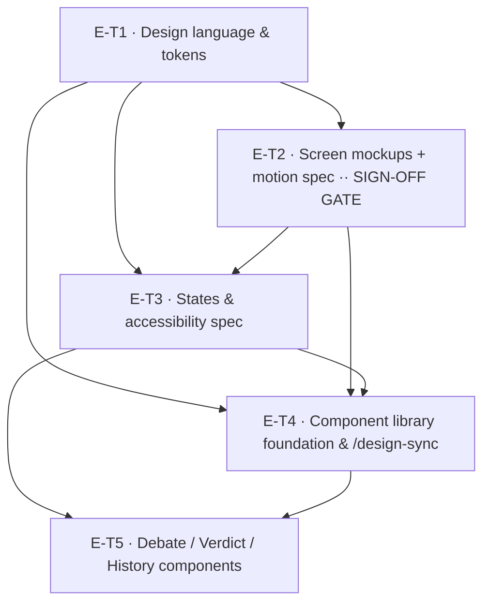

# Spec: EPIC-E — Design System & UX (KAN-11)

> **Epic:** [KAN-11](https://osavelyev.atlassian.net/browse/KAN-11) · **Project:** KAN (Second Opinion)
> **PRD:** `docs/second-opinion-prd.md` (Confluence page 1048577) ·
> **Decision Log:** DEC-004, DEC-006, DEC-010 (page 1015810)
> **Story shape:** `docs/specs/STORY_TEMPLATE.md`
> **Published:** [Confluence breakdown](https://osavelyev.atlassian.net/wiki/spaces/~557058b71ec4cb4cec4df2b96f8e5302aff766/pages/2261003) (page 2261003, child of the PRD)
> **Jira stories:** KAN-12 (E-T1), KAN-13 (E-T2), KAN-14 (E-T3), KAN-15 (E-T4), KAN-16 (E-T5)

## Epic summary

Define the visual + interaction design for Second Opinion **before** the EPIC-C build, and
stand up a reusable component library that EPIC-C consumes — so frontend tickets are planned
against an agreed design language instead of inventing one ad hoc. The flow is
`Artifacts (screens) → approve → design DEC → Claude Design project (components) → /design-sync
→ frontend/src/components → EPIC-C build`.

**Governing decisions (epic-level):** DEC-004 (watch-only — shapes the debate-view UX),
DEC-006 (threaded-chat debate UI, color-coded per persona), DEC-010 (design language +
Claude Design as the component source of truth).

## ⚠️ Gating & status — read before executing any ticket

This epic is **deferred until the frontend phase** (per the epic + PRD). Two gates apply
before *execution* of any ticket below — slicing them now is fine; building is not:

1. **DEC-010 is Accepted** (Decision Log, page 1015810) — the decision record is complete;
   no action needed on it. Its "Implemented by" entry currently reads `—` and backfills as
   these stories land (part of each story's Definition of Done).
2. **Backend must be underway.** EPIC-E runs in parallel to EPIC-A/B (KAN-1/2) but *precedes*
   EPIC-C (KAN-3). Don't start design execution until backend is in flight and the frontend
   phase is reachable.

## Design tokens (frozen in E-T1, consumed everywhere)

- **Persona palette** — a distinct, accessible color per archetype (Advocate / Skeptic /
  Pragmatist) with a **non-color cue** (icon/label/shape) so identity never relies on color
  alone (DEC-006 + a11y).
- **Color / type / spacing / radius / elevation** scales — light **and** dark.
- Delivered as (a) a token-reference Artifact and (b) a machine-usable token set (CSS custom
  properties / JSON) that the component library and EPIC-C import.

Freezing tokens in E-T1 is what lets the mockups (E-T2), the a11y spec (E-T3), and the
component library (E-T4/E-T5) all speak the same visual language.

## Tickets

### E-T1 — Design language & tokens (light + dark, persona palette)
- **Summary:** _As a designer/developer, I want an agreed token set — color, type, spacing,
  and a distinct accessible color-plus-cue per persona, in light and dark — so that every
  screen and component is built against one visual language instead of inventing one._
- **Scope / acceptance criteria:**
  - Color system, type scale, spacing/radius/elevation scales; light + dark themes.
  - Persona palette: distinct color per archetype **plus** a non-color cue (see E-T3), with
    AA contrast verified against both themes.
  - Delivered as a token-reference **Artifact** and a machine-usable token set
    (CSS custom properties / JSON) for downstream import.
- **Governing decisions:** DEC-006 (color-coded personas), DEC-010 (design language).
- **Files (est.):** `docs/design/tokens.md`, `design/tokens.json` (or
  `frontend/src/styles/tokens.css`), a token-reference Artifact.
- **Depends on:** none (DEC-010 Accepted).

### E-T2 — Core screen mockups + interaction/motion spec (Artifacts) — **sign-off gate**
- **Summary:** _As a stakeholder, I want clickable mockups of the four screens with the
  debate interaction and motion made concrete, so that we lock the look and the watch-only
  debate experience before any component is built._
- **Scope / acceptance criteria:**
  - Clickable HTML/React **Artifacts** for **Ask**, **Debate** (threaded, streaming reveal,
    round transitions, skip-to-verdict), **Verdict** (recommendation + case-per-option +
    trade-offs), **History**.
  - Interaction/motion spec: streaming token reveal, round transitions, "skip to verdict";
    debate is **watch-only** (DEC-004), threaded + color-coded per persona (DEC-006).
  - Built on E-T1 tokens. **This is the approval gate** — sign-off locks the look and the
    debate interaction before any component is built (DEC-010 is already Accepted).
- **Governing decisions:** DEC-004 (watch-only), DEC-006 (threaded/color-coded), DEC-010.
- **Files (est.):** Artifacts for the 4 screens; `docs/design/interaction-motion-spec.md`.
- **Depends on:** E-T1.

### E-T3 — States & accessibility spec
- **Summary:** _As any user (incl. keyboard-only, reduced-motion, and color-blind users), I
  want every screen to define its empty/loading/error states and meet a11y baselines, so that
  the experience is usable and trustworthy in the states real usage produces._
- **Scope / acceptance criteria:**
  - Empty / loading / error states for each of the 4 screens.
  - Reduced-motion behavior for the streaming reveal + round/skip transitions.
  - Keyboard navigation + focus order; **non-color persona cues** (icon/label/shape) that
    E-T1's palette and E-T4's persona primitive adopt.
  - Contrast validation of the E-T1 token set (AA) in light + dark.
  - Delivered as a written spec + annotated Artifact states.
- **Governing decisions:** DEC-006 (persona identity must survive without color).
- **Files (est.):** `docs/design/states-accessibility-spec.md`; annotated Artifact states.
- **Depends on:** E-T2 (specs the approved screens), E-T1 (token contrast).

### E-T4 — Component library foundation & /design-sync pipeline
- **Summary:** _As a frontend developer, I want a Claude Design project as the component
  source of truth and a working /design-sync pipeline that lands foundation primitives in
  frontend/src/components, so that EPIC-C imports real components instead of building them._
- **Scope / acceptance criteria:**
  - Stand up the **Claude Design** project as the component source of truth (DEC-010).
  - Establish the **`/design-sync` → `frontend/src/components`** pipeline (one component at a
    time). `frontend/` is a bare Vite + TS scaffold today (`src/components`, `src/hooks`,
    `src/pages` are empty `.gitkeep` placeholders — no UI yet); E-T4 fills the empty
    `src/components` dir. **Design (E-T1/E-T2) must be ready before this starts.**
  - Wire tokens (E-T1) → CSS variables; build **foundation primitives**: Button,
    TextArea/Input (Ask box), Card/Panel, layout primitives, and the **Persona identity**
    primitive (color + non-color cue from E-T3).
  - Verify one component round-trips through `/design-sync` into `frontend/src/components`.
- **Governing decisions:** DEC-010 (Claude Design source of truth + /design-sync), DEC-006.
- **Files (est.):** Claude Design project; `frontend/src/components/*` (foundation),
  `frontend/src/styles/tokens.css`; `/design-sync` config.
- **Depends on:** E-T1, E-T2, E-T3.

### E-T5 — Debate, Verdict & History components (screen-specific)
- **Summary:** _As the EPIC-C build, I want the screen-specific components — the debate view,
  the verdict, and history — synced into frontend/src/components with their states, so that
  the Web Experience is assembled from ready-made, on-design pieces._
- **Scope / acceptance criteria:**
  - Debate view components: threaded message bubble, streaming-reveal text, round divider,
    skip-to-verdict control (watch-only per DEC-004; color + cue per DEC-006/E-T3).
  - Verdict components: recommendation card, per-option case, trade-offs list.
  - History components: list item + empty state.
  - Each carries its E-T3 states and consumes E-T4 foundation primitives; synced via
    `/design-sync` one component at a time. **These are the components EPIC-C (KAN-3) imports.**
- **Governing decisions:** DEC-004 (watch-only), DEC-006 (threaded/color-coded), DEC-010.
- **Files (est.):** `frontend/src/components/debate/*`, `.../verdict/*`, `.../history/*`.
- **Depends on:** E-T4 (pipeline + primitives), E-T3 (states).

## Dependency graph

## Suggested execution order

- **Gate (before Wave 1):** confirm the frontend phase is reachable (backend underway).
  DEC-010 is already Accepted — no decision gate remains; just backfill its "Implemented by"
  as stories land.
- **Wave 1:** E-T1 — the token foundation everything else speaks.
- **Wave 2:** E-T2 — the **sign-off gate**. Lock the look + debate interaction before any
  component is built.
- **Wave 3 (parallel):** E-T3 and E-T4. They meet on the **persona non-color cue** — settle
  that part of E-T3 first (or coordinate) so E-T4's Persona primitive adopts it; the rest of
  E-T4's foundation (token wiring, Button/Input/Card) can proceed alongside the a11y spec.
- **Wave 4:** E-T5 — screen-specific components on top of the foundation; hands EPIC-C its
  import surface.

## Definition of Done (per ticket)

Each ticket follows `STORY_TEMPLATE.md`: acceptance criteria met, design artifacts approved,
Decision Log "Implemented by" updated for the DECs it realizes (esp. DEC-010), and — for
E-T4/E-T5 which touch `frontend/src/**` — `/validate` green, `/code-review` clean, and the
commit references its governing `DEC-xxx` (per the commit-msg hook).
